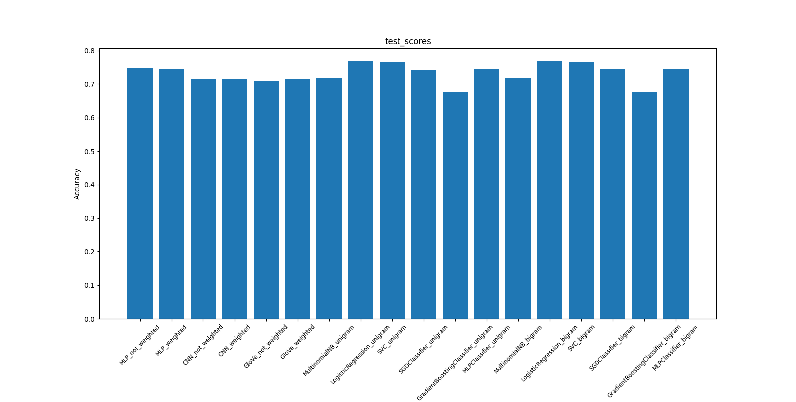

# nlpcovid

### File Descriptions

* main.py: reads input, calls cleaning functions, calls classification functions
* Preprocessing.py: text preprocessing and cleaning function
* utils.py: other utility functions
* Dataset.py: dataset class, creates a dataset object that has the training and test data, the vectorizer object (only for one-hot and glove), and the input vocabulary  
* Vectorizer.py: vectorizer class, creates the vectorizer object that handles one-hot and glove vectorization. For Tf-IDF, I use sklearn's TfidfVectorizer. The vectorizer object is attached to the dataset object
* Vocabulary.py: vocabulary class, creates the vocabulary object that will be attached to the vectorizer object
* SequenceVocabulary.py: similar to the vocabulary class, but has additional tokens for text start/end markers. Used with glove vectorization
* MLP.py: multi perceptron layer class, creates the MLP classifier
* CNN.py: convolutional neural network class, creates the CNN classifier
* GloVeClassifier.py: combination neural network class, creates a CNN+MLP classifier, to be used with glove vectorization

### Results

The following barchart shows the test results of the classification models implemented here:

